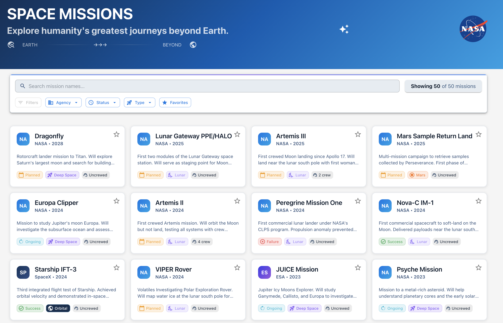
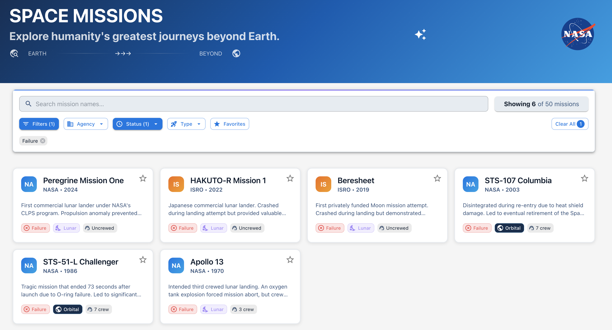
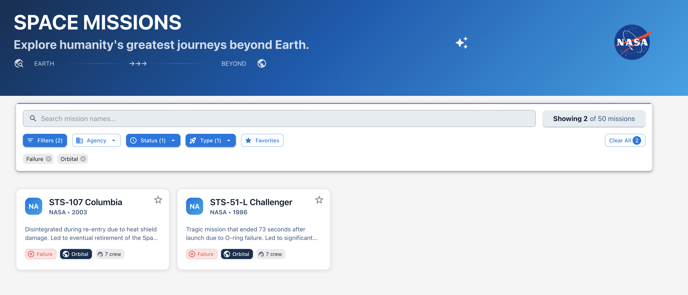
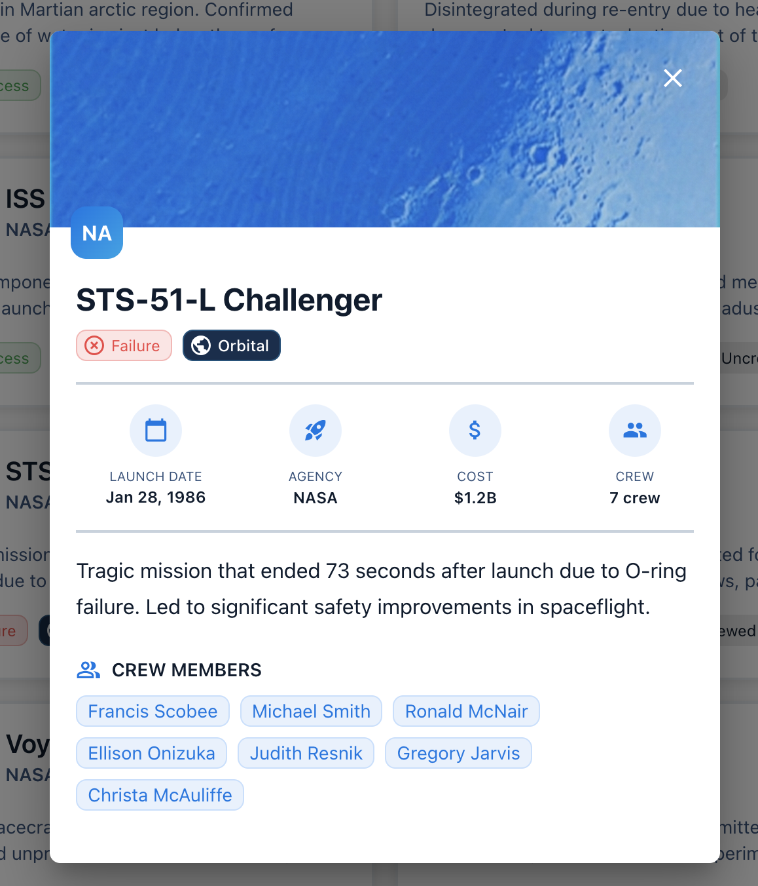
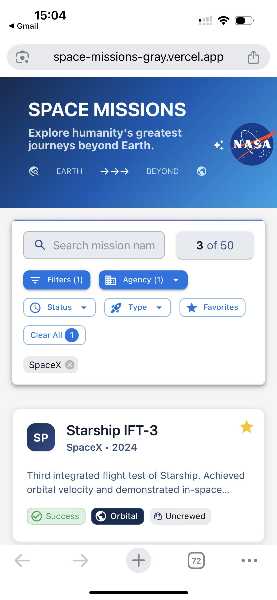
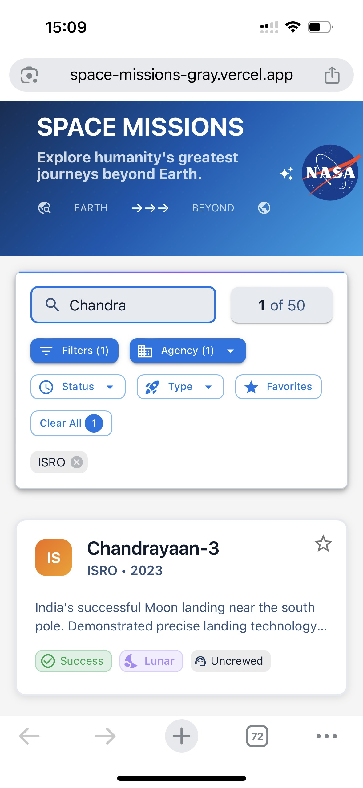
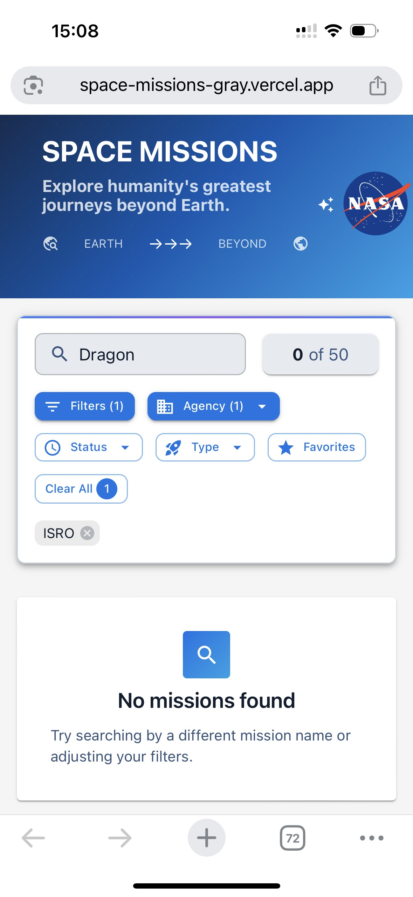
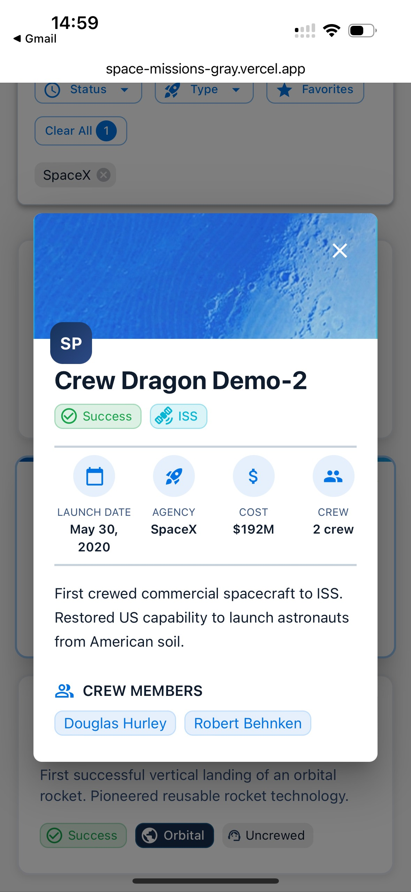

# Space Missions

This is a minimal React 18 + TypeScript + Material UI Space Missions app.

## Getting Started

1. **Install dependencies:**
   ```sh
   npm install
   ```
2. **Start the development server:**
   ```sh
   npm run dev
   ```
3. Open [http://localhost:5173](http://localhost:5173) in your browser.

## Project Structure

- `src/App.tsx`: Main app component (uses Material UI)
- `src/main.tsx`: Entry point
- `index.html`: HTML template

Start building your solution in `src/App.tsx`.

## Design Decisions Overview:

## 1. **Design Decisions**

### Layout Choice

I chose a **card-based grid layout** for displaying missions because it works best for this type of data. Cards let users quickly scan mission information at a glance - they can see the mission name, agency, year, status, and type all in one place without clicking. The grid adapts from 1 column on mobile to 4 columns on large screens, making efficient use of space. Cards also feel more modern and engaging than a plain table, and they clearly show that each mission is clickable.

### Filtering UX Approach

I organized filters as **discoverable buttons** at the top because users need to find them immediately. Each filter button shows a count badge when active (e.g., "Agency (2)"), giving instant visual feedback. The filters use dropdown menus with checkboxes, allowing multiple selections - this is intuitive because users often want to see missions from multiple agencies or with multiple statuses. Active filters appear as chips below the buttons, so users can see what's applied and remove individual filters easily. The "Clear" button appears when filters are active, making it easy to reset everything.

### Navigation Pattern (Modal vs. Routing)

I chose a **modal/dialog** for the mission detail view instead of routing. This keeps users in context - they can see the detail view without losing their place in the filtered list. When they close the modal, they're right back where they were. Modals also work better on mobile devices and feel faster since there's no page reload. The overlay clearly shows it's a focused view while maintaining connection to the main list.

### Responsive Strategy

For mobile optimization, I used a **mobile-first approach**. The grid starts at 1 column on mobile (xs={12}), then expands to 2 columns on small tablets (sm={6}), 3 on medium screens (md={4}), and 4 on large screens (lg={3}). Filter buttons wrap naturally on smaller screens. The mission detail modal uses smaller font sizes and tighter spacing on mobile, and the key metrics section displays all 4 items in one row on mobile (xs={3}) so users don't have to scroll. Touch targets are large enough (minimum 40px) for easy tapping.

### Accessibility Considerations

I made several accessibility improvements: All interactive elements have ARIA labels (search field, filter buttons, favorite buttons). Mission cards are keyboard accessible with Enter/Space keys and have visible focus states. The dialog has proper aria-labelledby and aria-describedby attributes. Decorative icons have aria-hidden="true" so screen readers skip them. Filter buttons announce their state with aria-expanded and aria-pressed. Semantic HTML is used throughout (h1, h2, article elements).

### MUI Component Choices

I used **Card** components for missions because they provide built-in elevation and hover effects. **TextField** with InputAdornment for search gives a polished look with the search icon. **Button** components with startIcon/endIcon make filter buttons clear and consistent. **Menu** components for dropdowns provide proper keyboard navigation out of the box. **Chip** components for active filters are perfect - they're designed for removable tags. **Grid** system handles responsive layout automatically. **Dialog** for mission details provides proper focus management and backdrop.

## 2. **Visual Design Choices**

### Color Choices

I used **blue (#1976d2)** as the primary color because space missions feel futuristic and trustworthy - blue communicates exploration and technology. Status colors follow common conventions: **green** for Success (positive outcome), **red** for Failure (warning/error), **blue** for Ongoing (active/in progress), and **orange** for Planned (upcoming/excitement). The light gray background (#f5f5f5) reduces eye strain and makes the white cards pop. Favorite stars use **gold (#ffc107)** to make them stand out as special.

### Typography Hierarchy

The **h1** title "Space Missions" is large and bold (2-3rem) to establish the page identity. Mission card titles use **h6** variant (1.25rem) - large enough to scan but not overwhelming. Body text uses standard sizes (0.875-1rem) for readability. Labels like "LAUNCH DATE" use small uppercase text (0.625rem) to create clear hierarchy and feel technical/precise. The mission detail modal uses a smaller h4 (1.5rem) since it's secondary content.

### Spacing and Visual Rhythm

I used consistent spacing throughout: **2-3rem** padding for major sections, **1.5rem** spacing between cards, **1rem** spacing between filter buttons. Cards have **2rem** internal padding for comfortable reading. The spacing creates a rhythm that guides the eye naturally from top to bottom. White space between sections prevents visual clutter and makes the interface feel clean and organized.

### Status Indicators and Their Meanings

Status is shown with **colored chips** - this is immediately recognizable and doesn't require reading text. The calendar icon on status chips reinforces that it's about timing/state. Mission type chips use simple text labels because types are descriptive enough. The combination of color + icon + text makes status information scannable at a glance. In the detail view, status colors match the chips for consistency.

## 3. **What You'd Improve:**

### UX Enhancements

With more time, I'd add **filter presets** (e.g., "Recent Missions", "Mars Missions") for quick access. **Sort options** (by date, cost, name) would help users find specific missions. **Saved filter combinations** would let users bookmark their favorite filter sets. **Infinite scroll** or pagination would handle large result sets better. **Keyboard shortcuts** (e.g., "/" to focus search) would speed up power users. **Filter suggestions** based on current selections could guide exploration.

### Design Polish and Animations

I'd add **smooth transitions** when filters change - cards fading in/out rather than instantly appearing. **Loading skeletons** would improve perceived performance. **Micro-interactions** like cards slightly lifting on hover with a shadow would feel more polished. **Staggered animations** when cards first load would create visual interest. **Toast notifications** when favoriting/unfavoriting would provide feedback. **Smooth modal transitions** (fade + scale) would feel more premium.

### User Testing Insights

I'd want to test: **Filter discoverability** - do users find the filter buttons easily? **Search behavior** - do users search by name, or do they prefer filters? **Card information** - is the right amount of info shown, or too much/too little? **Mobile experience** - are touch targets large enough, is scrolling comfortable? **Detail view** - do users prefer modal or separate page? **Favorite usage** - do users actually use favorites, and how? **Filter combinations** - which filters are used together most often?

## Screenshots

### Desktop view




![Desktop view]
![Desktop view: filters]
![Desktop view: filters]
![Desktop: Mission Deatail view]

### Mobile view

![Mobile view: filters]
![Mobile view:filters]
![Mobile: No found view]
![Mobile: Mission Detail view]
